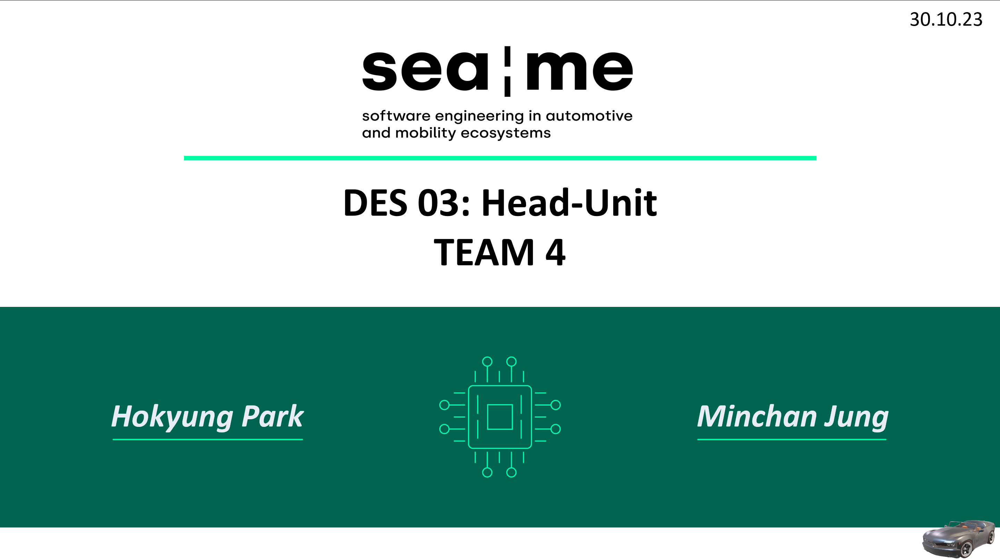

# DES_Head-Unit
The head unit Qt application running on Raspberry Pi (RPi) alongside the instrument cluster Qt application

## [app-hu](https://github.com/SEA-ME-Team4/app-hu/tree/6638c8387d873ca45630762a8e2856634d955ef9)

<embed src="https://docs.google.com/viewer?url=https://github.com/SEA-ME-Team4/DES_Head-Unit/blob/main/DES_Head-Unit.pdf" />

### Instrument Cluster

  

### Head Unit

  

## [meta-hu](https://github.com/SEA-ME-Team4/meta-hu/tree/b58ddd20477552ce87f6e002663c21110a3f88d6)

  

